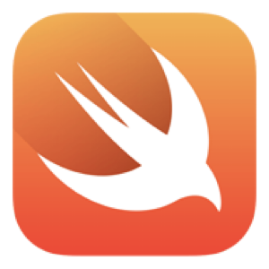
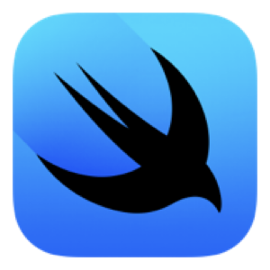
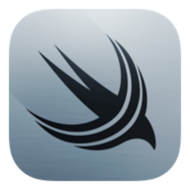
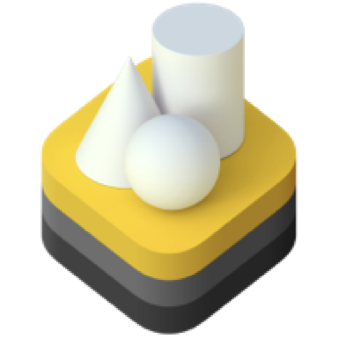
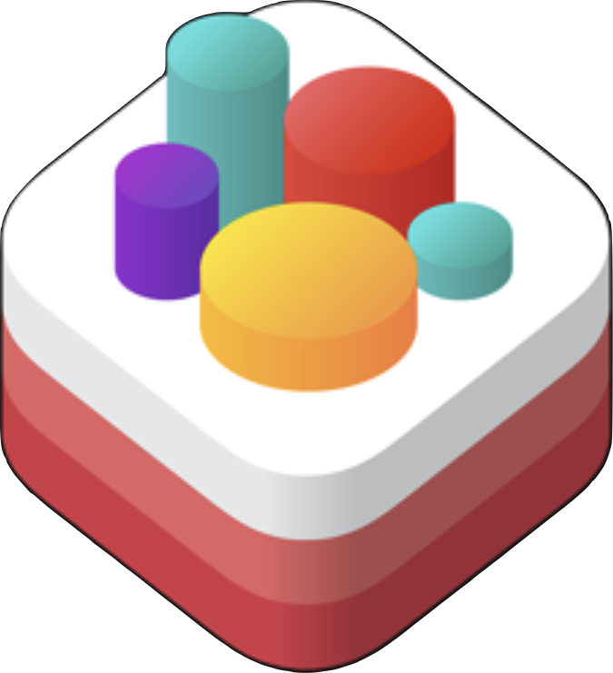
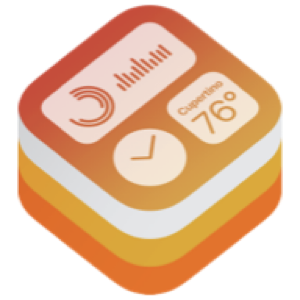
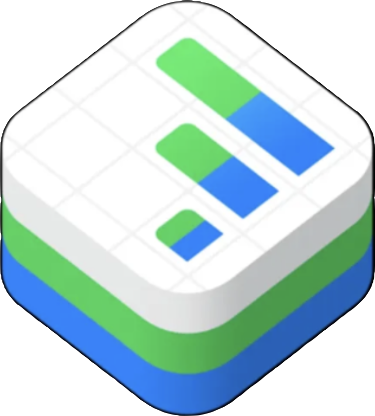
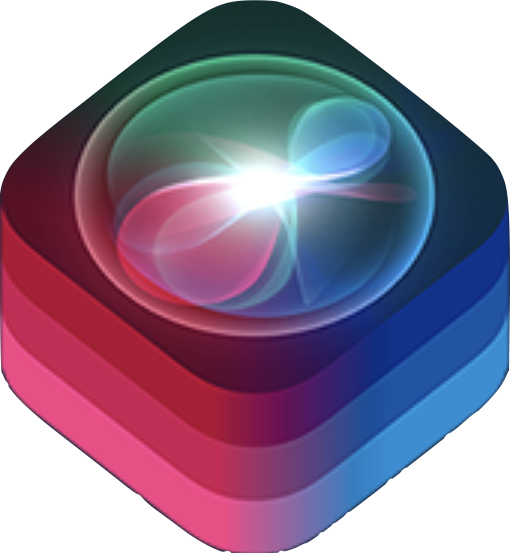

<h2 align="center">Swiftly coding my way through the Apple ecosystem</h2>

A passionate **iOS Developer** who:

- 🔭 is a self-motivated individual with technical, analytical, and problem-solving skills.
- 🧠 loves exploring technical content writing.
- 😼 is looking to collaborate on international-scale projects.

 You can reach me via: 
- Scholarly Email: karami.mehdi.scholar@gmail.com
- Work Correspondence Email: karami.mehdi.work@gmail.com

## 👾 Technologies with which I unleash the Monster:
&nbsp;
&nbsp;
&nbsp;
&nbsp;
&nbsp;
&nbsp;
&nbsp;&nbsp;
&nbsp;&nbsp;
&nbsp;
&nbsp;
&nbsp;
&nbsp;&nbsp;
&nbsp;&nbsp;
&nbsp;
&nbsp;

## 👨🏻‍💻 Crafting the Future of United Tech Brilliance:
iCode, iCreate, iInnovate. 📱💻🌟

## 📊 My Stats:

